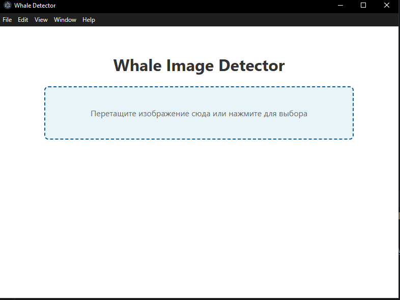

# Whale Detector UI

Desktop-приложение для загрузки изображений и визуализации результатов детекции китов.
Интерфейс реализован на Electron и взаимодействует с backend API, написанным на FastAPI.

Приложение позволяет загрузить изображение (через drag & drop или выбор файла), отправить его на сервер и отобразить результат обработки.

---

## Возможности

- Drag & Drop загрузка изображений
- Выбор изображения через файловый диалог
- Отправка изображений на backend
- Отображение результата детекции
- Индикатор загрузки (spinner)
- Desktop-интерфейс на Electron

---

## Стек технологий

- Electron
- TypeScript
- HTML / CSS
- Fetch API

---

## Установка

- Склонировать репозиторий на свою систему
- Установите LTS-версию Node.js с [официального сайта](https://nodejs.org/en). Проверьте установку:
```bash
node -v
npm -v
```
- Перейти в корень проекта и выполнить установку зависимостей
```
 npm install
```

- Запустить приложение
```
 npm run start
```

- Запущенное приложение



## Подключение Backend API

Для отправки запросов необходимо установить и запустить backend сервис.

Инструкция находится в связанном проекте - https://github.com/Artniz23/WhalesDetectorApi


